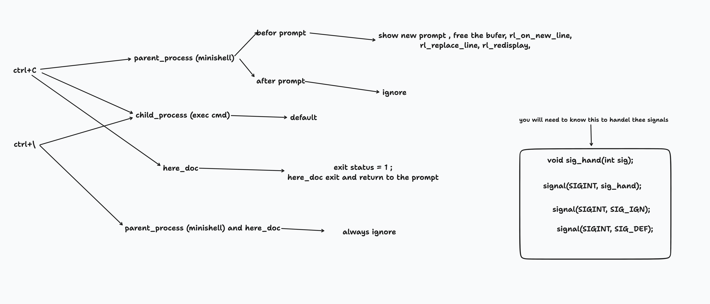

# Minishell

## Description
Minishell is a simple shell implementation project, aiming to recreate basic functionalities of bash. This project is part of the 42 school curriculum and focuses on process creation, file descriptors, and command interpretation.

## Features

- Display a prompt for new commands
- Working command history
- Execute commands (using PATH, relative, or absolute paths)
- Handle single quotes (') and double quotes (")
- Implement redirections: <, >, <<, >>
- Implement pipes (|)
- Handle environment variables and $?
- Handle signals: ctrl-C, ctrl-D, ctrl-\
- Implement built-in commands:
  - echo (with -n option)
  - cd (with relative or absolute path)
  - pwd
  - export
  - unset
  - env
  - exit

## ***Usage***
1. download the GNU readline library [https://ftpmirror.gnu.org/readline/readline-8.2.tar.gz](https://ftpmirror.gnu.org/readline/readline-8.2.tar.gz)
2. unzip the readline library using this command :
    ```
    tar -xvzf readline-8.2.tar.gz
    ```
3. clone this repo :
    ```
    git clone https://github.com/abouramd/minishell.git
    ```
4. go to the `Makefile` and replace `~/readline` with the path of the readline library in this variable :
    ```
    READLINE_PATH:= #put the path of readline here#
    ```
    if you don't now how to find the path of readline you can just go inside the folder of readline and use `pwd` command.
5. after doing all that you will go to folder of minishell and you run this commad:
    ```
    make readline_create all
    ```
    the first rule will configure and compile readline library and the second will make compile minishell.
6. now you can run minishell just like this :
    ```
    ./minishell
    ```

## ***External function***
1. **readline():**
    - Prototype: 
        ```C
         char *readline(const char *prompt)
        ```
    - This function is used to read a line of input from the user. It takes a prompt as an argument, which is displaye  to the user to indicate that input is expected. The function returns a pointer to a string containing the input entered by the user. The maximum length of the input line is determined by the value of the RL_BUFSIZE macro.

1. **rl_clear_history():**
    - Prototype: 
        ```C
         void rl_clear_history(void)
        ```
    - This function is used to clear the history list of previously entered commands. The history list is maintained by the readline library and can be accessed using the rl_history_list variable.

1. **rl_on_new_line():**
    - Prototype: 
        ```C
         void rl_on_new_line(void)
        ```
    - This function is used to move the cursor to a new line on the terminal. 
1. **rl_replace_line():**
    - Prototype: 
        ```C
         void rl_replace_line(const char *text, int clear_undo)
        ```
    - This function replaces the current input line with the provided text. If clear_undo is non    -zero, then the undo list is cleared.

1. **rl_redisplay():**
    - Prototype: 
        ```C
         void rl_redisplay(void)
        ```
    - This function is used to redisplay the current input line on the terminal. 
1. **add_history():**
    - Prototype: 
        ```C
         void add_history(const char *line)
        ```
    - This function is used to add a line of text to the history list of previously entered commands. 
1. **printf():**
    - Prototype: 
        ```C
         int printf(const char *format, ...)
        ```
    - This function is used to print formatted output to the standard output stream. The format string specifies the output format and any additional arguments are inserted into the format string as specified by the format specifiers.

1. **malloc():**
    - Prototype: 
        ```C
         void *malloc(size_t size)
        ```
    - This function is used to allocate a block of memory of the specified size. The allocated memory is uninitialized and should be initialized by the caller.

1. **free():**
    - Prototype: 
        ```C
         void free(void *ptr)
        ```
    - This function is used to deallocate a previously allocated block of memory. 
1. **write():**
    - Prototype: 
        ```C
         ssize_t write(int fd, const void *buf, size_t count)
        ```
    - This function is used to write data from the buffer pointed to by buf to the file or device specified by the file descriptor fd. The count argument specifies the number of bytes to write.

1. **access():**
    - Prototype: 
        ```C
         int access(const char *pathname, int mode)
        ```
    - This function is used to check if the calling process can access the file or directory specified by pathname. The mode argument specifies the type of access to check (read, write, or execute).

1. **open():**
    - Prototype: 
        ```C
         int open(const char *pathname, int flags, mode_t mode)
        ```
    - This function is used to open a file or device specified by pathname. The flags argument specifies the mode in which the file should be opened (read, write, or both). The mode argument specifies the permissions to be set on the file if it is created.

1. **read():**
    - Prototype: 
        ```C
         size_t read(int fd, void *buf, size_t count)
        ```
    - This function is used to read data from the file or device specified by the file descriptor fd into the buffer pointed to by buf. The count argument specifies the maximum number of bytes to read.

1. **close():**
    - Prototype: 
        ```C
         int close(int fd)
        ```
    - This function is used to close a file or device specified by the file descriptor fd. 
1. **fork():**
    - Prototype: 
        ```C
         pid_t fork(void)
        ```
    - This function is used to create a new process by duplicating the calling process. The new process is called the child process, and the calling process is called the parent process.

1. **wait():**
    - Prototype: 
        ```C
         pid_t wait(int *status)
        ```
    - This function is used by the parent process to wait for the child process to terminate. The status argument is used to store the exit status of the child process.

1. **waitpid():**
    - Prototype: 
        ```C
         pid_t waitpid(pid_t pid, int *status, int options)
        ```
    - This function is similar to wait(), but it allows the parent process to wait for a specific child process to terminate, rather than any child process.

1. **wait3():**
    - Prototype: 
        ```C
         int wait3(int *status, int options, struct rusage *rusage)
        ```
    - This function is similar to waitpid(), but it also returns resource usage statistics for the child process in the rusage structure.

1. **wait4():**
    - Prototype: 
        ```C
         int wait4(pid_t pid, int *status, int options, struct rusage *rusage)
        ```
    - This function is similar to waitpid(), but it also returns resource usage statistics for the child process in the rusage structure.

1. **signal():**
    - Prototype: 
        ```C
         void (*signal(int signum, void (*handler)(int)))(int)
        ```
    - This function is used to establish a signal handler for a specific signal. The signum argument specifies the signal to be handled, and the handler argument specifies the function to be called when the signal is received.

1. **sigaction():**
    - Prototype: 
        ```C
         int sigaction(int signum, const struct sigaction *act, struct sigaction *oldact)
        ```
    - This function is used to examine or modify the action taken by a process when a specific signal is received. The signum argument specifies the signal to be examined or modified, and the act argument specifies the new signal action.

1. **sigemptyset():**
    - Prototype: 
        ```C
         int sigemptyset(sigset_t *set)
        ```
    - This function is used to initialize an empty signal set. 
1. **sigaddset():**
    - Prototype: 
        ```C
         int sigaddset(sigset_t *set, int signum)
        ```
    - This function is used to add a signal to a signal set. 
1. **kill():**
    - Prototype: 
        ```C
         int kill(pid_t pid, int sig)
        ```
    - This function is used to send a signal to a process or a group of processes specified by pid. 
1. **exit():**
    - Prototype: 
        ```C
         void exit(int status)
        ```
    - This function is used to terminate the calling process and return the exit status to the parent process. 
1. **getcwd():**
    - Prototype: 
        ```C
         char *getcwd(char *buf, size_t size)
        ```
    - This function is used to get the current working directory of the calling process. The buf argument specifies a buffer to store the current working directory, and the size argument specifies the size of the buffer.

1. **chdir():**
    - Prototype: 
        ```C
         int chdir(const char *path)
        ```
    - This function is used to change the current working directory of the calling process to the directory specified by path.

1. **stat():**
    - Prototype: 
        ```C
         int stat(const char *path, struct stat *buf)
        ```
    - This function is used to get information about a file specified by path and store it in the stat structure pointed to by buf.

1. **lstat():**
    - Prototype: 
        ```C
         int lstat(const char *path, struct stat *buf)
        ```
    - This function is similar to stat(), but it returns information about the symbolic link itself, rather than the file or directory it points to.

1. **fstat():**
    - Prototype: 
        ```C
         int fstat(int fd, struct stat *buf)
        ```
    - This function is similar to stat(), but it returns information about the file or device specified by the file descriptor fd.

1. **unlink():**
    - Prototype: 
        ```C
         int unlink(const char *pathname)
        ```
    - This function is used to delete the file specified by pathname. 
1. **execve():**
    - Prototype: 
        ```C
         int execve(const char *pathname, char *const argv[], char *const envp[])
        ```
    - This function is used to replace the current process image with a new process image specified by pathname. The argv argument is an array of pointers to null  -terminated strings that represent the argument list for the new process. The envp argument is an array of pointers to null   -terminated strings that represent the environment list for the new process.

1. **dup():**
    - Prototype: 
        ```C
         int dup(int oldfd)
        ```
    - This function is used to create a new file descriptor that refers to the same file as the old file descriptor oldfd.

1. **dup2():**
    - Prototype: 
        ```C
         int dup2(int oldfd, int newfd)
        ```
    - This function is similar to dup(), but it allows the programmer to specify the file descriptor number of the new file descriptor, rather than letting the system choose the next available number.

1. **pipe():**
    - Prototype: 
        ```C
         int pipe(int pipefd[2])
        ```
    - This function is used to create a pair of file descriptors that are connected by a pipe, which allows communication between processes.

1. **opendir():**
    - Prototype: 
        ```C
         DIR *opendir(const char *name)
        ```
    - This function is used to open a directory specified by name and return a pointer to a DIR structure that can be used to read the contents of the directory.

1. **readdir():**
    - Prototype: 
        ```C
         struct dirent *readdir(DIR *dirp)
        ```
    - This function is used to read the next directory entry from the directory specified by the DIR structure pointed to by dirp.

1. **closedir():**
    - Prototype: 
        ```C
         int closedir(DIR *dirp)
        ```
    - This function is used to close the directory specified by the DIR structure pointed to by dirp. 
1. **strerror():**
    - Prototype: 
        ```C
         char *strerror(int errnum)
        ```
    - This function is used to return a pointer to a string that describes the error code errnum. 
1. **perror():**
    - Prototype: 
        ```C
         void perror(const char *s)
        ```
    - This function is used to print an error message to stderr that describes the last error encountered during a system call. The string s is prepended to the error message.

1. **isatty():**
    - Prototype: 
        ```C
         int isatty(int fd)
        ```
    - This function is used to determine if the file descriptor fd refers to a terminal. 
1. **ttyname():**
    - Prototype: 
        ```C
         char *ttyname(int fd)
        ```
    - This function is used to return a pointer to a string that represents the name of the terminal associated with the file descriptor fd.

1. **ttyslot():**
    - Prototype: 
        ```C
         int ttyslot()
        ```
    - This function is used to return the index of the entry in the terminfo database that corresponds to the terminal associated with the calling process.

1. **ioctl():**
    - Prototype: 
        ```C
         int ioctl(int fd, unsigned long request, ...)
        ```
    - This function is used to perform various control operations on a device or file descriptor. The request argument specifies the operation to be performed, and the remaining arguments depend on the specific operation.

1. **getenv():**
    - Prototype: 
        ```C
         char *getenv(const char *name)
        ```
    - This function is used to retrieve the value of the environment variable specified by name. 
1. **tcsetattr():**
    - Prototype: 
        ```C
         int tcsetattr(int fd, int optional_actions, const struct termios *termios_p)
        ```
    - This function is used to set the terminal attributes for the terminal associated with the file descriptor fd. 
1. **tcgetattr():**
    - Prototype: 
        ```C
         int tcgetattr(int fd, struct termios *termios_p)
        ```
    - This function is used to get the current terminal attributes for the terminal associated with the file descriptor fd.

1. **tgetent():**
    - Prototype: 
        ```C
         int tgetent(char *bp, const char *name)
        ```
    - This function is used to retrieve the entries for the terminal type specified by name from the terminfo database and store them in the buffer pointed to by bp.

1. **tgetflag():**
    - Prototype: 
        ```C
         int tgetflag(const char *capname)
        ```
    - This function is used to retrieve the value of the boolean capability specified by capname for the current terminal type.

1. **tgetnum():**
    - Prototype: 
        ```C
         int tgetnum(const char *capname)
        ```
    - This function is used to retrieve the numeric value of the capability specified by capname for the current terminal type.

1. **tgetstr():**
    - Prototype: 
        ```C
         char *tgetstr(const char *capname, char **area)
        ```
    - This function is used to retrieve the string value of the capability specified by capname for the current terminal type. The area argument is a pointer to a pointer that is used to store the string returned by the function.

1. **tgoto():**
    - Prototype: 
        ```C
         char *tgoto(const char *capname, int col, int row)
        ```
    - This function is used to create a cursor movement sequence that can be used to move the cursor to the specified column and row on the screen. The capname argument specifies the capability that describes the cursor movement sequence.

1. **tputs():**
    - Prototype: 
        ```C
         int tputs(const char *str, int affcnt, int (*putc)(int))
        ```
    - This function is used to send a string of terminal control codes to the terminal. The affcnt argument specifies the number of lines affected by the operation, and the putc argument is a pointer to a function that is used to output characters to the terminal. The return value of the function is zero on success, and non   -zero on failure.


# ***explain ctrl-C, ctrl-D and ctrl-\\***
1. **ctrl + C**
    - "ctrl c" is a keyboard shortcut that sends a signal to an active program or process to interrupt or terminate it. This signal is called the SIGINT signal (short for "signal interrupt"), and it is typically used to gracefully stop a program or process that is currently running.

    - When you press "ctrl c" in a terminal window, the operating system sends the SIGINT signal to the currently running process, which may then choose to perform some cleanup or shutdown operations before exiting. If the process doesn't respond to the SIGINT signal, you can try sending a stronger signal like SIGKILL using the "kill" command.

    - In summary, "ctrl c" is a useful way to gracefully interrupt or stop a running program or process, and it is accomplished by sending the SIGINT signal.    

1. **ctrl + \\**
    - "ctrl \\" is a keyboard shortcut that sends a signal to an active program or process to generate a core dump or a stack trace. This signal is called the SIGQUIT signal, and it is typically used for debugging or troubleshooting purposes.

    - When you press "ctrl \\" in a terminal window, the operating system sends the SIGQUIT signal to the currently running process, which may then generate a core dump or a stack trace that can be analyzed by a developer or system administrator. This can help identify issues like memory leaks, segmentation faults, or other types of errors that might be causing the program to crash or behave unexpectedly.

    - It's worth noting that generating a core dump or a stack trace can be a resource  -intensive operation, and it may not be appropriate or desirable for all types of programs or processes. As such, the SIGQUIT signal is typically used only when specifically needed for debugging or troubleshooting purposes.

1. **ctrl + D**
    - "ctrl + D" is a keyboard shortcut that sends an end   -of    -file (EOF) signal to an active program or process. This signal indicates to the program that there is no more input to be read from the current source, and the program should exit or move on to the next operation.

    - In Unix   -based operating systems, including Linux and macOS, pressing "ctrl + D" in a terminal window sends an EOF signal to the currently running program or shell. This is often used to indicate the end of user input, such as when entering commands or data into a terminal. For example, in the Bash shell, pressing "ctrl + D" at the beginning of a line will exit the shell and return you to the parent shell or command prompt.

    - It's worth noting that the behavior of "ctrl + D" may vary depending on the program or context in which it is used. In some cases, pressing "ctrl + D" may delete text or perform other actions, so it's always a good idea to check the documentation or help files for the program you are using to understand its specific behavior.


# ***explain redirections***
- Redirections are a way of controlling input and output in a command   -line or shell environment. The most commonly used redirection operators are:

    1. **">" - Output redirection:** This operator redirects the output of a command or program to a file. For example: 
        ```bash
        ls > file.txt 
        ```
        would direct the output of the "ls" command to a file named "file.txt". If the file already exists, its content will be overwritten with the new output.

    2. **"<" - Input redirection:** This operator redirects the input of a command or program from a file. For example: 
        ```bash
        sort < input.txt
        ```
        would take the input from a file named "input.txt" instead of waiting for user input.

    3. **">>" - Append output redirection:** This operator is similar to the ">" operator but appends the output of a command or program to the end of a file. For example: 
        ```bash
        echo 'new line' >> file.txt
        ```
        would add the string "new line" to the end of a file named "file.txt".

    4. **"<<" - Here - document:** This operator allows you to input multiple lines of text as input to a command or program. For example: 
        ```bash
        cat << END
        ```
        would allow you to input multiple lines of text until you type "END" on a new line.

    5. **"|" - Pipe Redirection:** This involves redirecting the output of one command to the input of another command. For example, the "|" operator can be used to pipe the output of one command to the input of another command, like: 
        ```bash
        ls | grep file
        ```
        would list all files in the current directory and then filter the results to only show files that contain the word "file".
        For more explain:
        ```bash
        who | sort | lpr
        ```
        ```mermaid
        sequenceDiagram
            participant who_process
            participant pipe_1
            participant sort_process
            participant pipe_2
            participant lpr_process
            who_process->>pipe_1: write in the write fd of the pipe
            pipe_1->>sort_process: read from the read fd of the pipe
            sort_process->>pipe_2: write in the write fd of the pipe
            pipe_2->>lpr_process: read from the read fd of the pipe
        ```

- These redirection operators are used to control the input and output of commands and programs in the command  -line or shell environment. They are very powerful tools that allow you to automate tasks, combine commands and programs, and redirect output to files for later analysis or processing.
